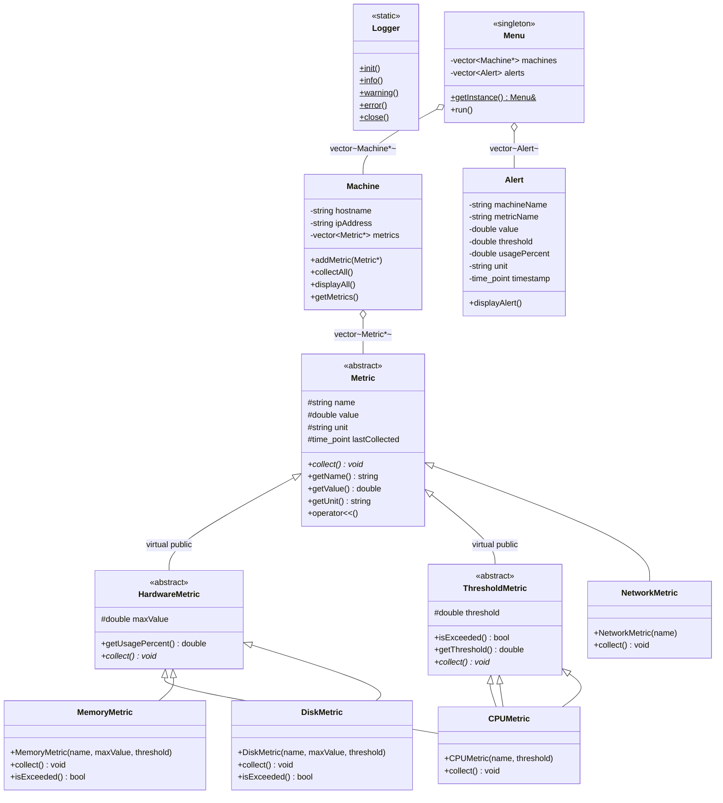
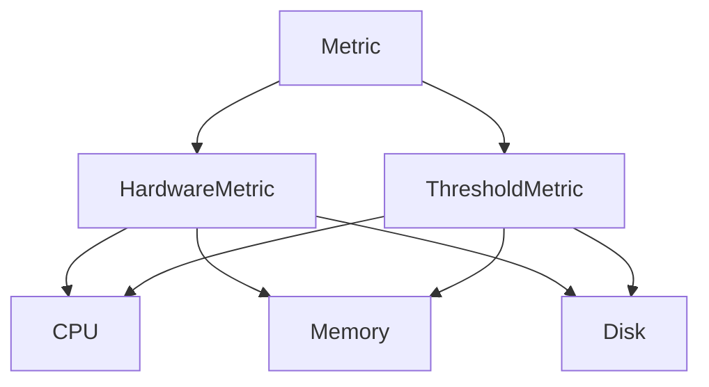

# Argus 👁️
A system monitor application  with analog style display for Homelabs, built in C++.
> This project was developed as part of the course "Object-Oriented Programming", under the supervision of [Prof. PhD. Andrei PAUN](https://scholar.google.com/citations?user=wWNnd94AAAAJ&hl=en), at the Department for Mathematics and Computer Science, University of Bucharest.

Argus monitors multiple machines by collecting and tracking hardware and network metrics (CPU, Memory, Disk, Network). It detects anomalies and threshold violations and generated alerts automatically.

## Class Hierarchy
##### Legenda:
| Simbol | Inseamna |
|---|---|
| `-` | `private` |
| `#` | `protected` |
| `+` | `public` |
| `$` | `static` |
| `*` | `pur virtual/abstract` |

### Diamond Inheritance

`CPUMetric`, `MemoryMetric` and `DiskMetric` each inherit from both `HardwareMetric` and `ThresholdMetric`, both of which inherit from `Metric` using `virtual public`. This ensured a single shared instance of `Metric` per object.

### Cerinte proiect

| Requirement | Implementation |
|---|---|
| Minim 10 clase | 12 clase: `Metric`, `HardwareMetric`, `ThresholdMetric`, `CPUMetric`, `MemoryMetric`, `DiskMetric`, `NetworkMetric`, `Machine`, `Alert`, `Logger`, `Menu`, `Exceptions` |
| Ierarhie de mostenire (6+ classes) | `Metric` → `HardwareMetric` → `CPUMetric/MemoryMetric/DiskMetric` (3 niveluri) |
| Mostenire diamant | `CPUMetric`, `MemoryMetric`, `DiskMetric` cu `virtual public` |
| Metode si membri static | `Logger` — (`init`, `info`, `warning`, `error`, `close`) |
| Encapsulare | `private`/`protected`/`public` folosite; `value` e `protected` pentru suprascriere in subclase |
| Regula celor Trei | `Machine` are `destructor` custom. Am decis ca copierea nu are sens pentru o masina monitorizata, deci am interzis explicit `constructorul de copiere` și `operator=` |
| `std::vector` | `Machine` contine `vector<Metric*>`; `Menu` contine `vector<Machine*>` si `vector<Alert>` |
| Polimorfism si clase abstracte | `Metric` e abstracta (`collect() = 0`); `operator<<` prin virtual `afisare()` |
| Exceptii custom | `ArgusException`, `InvalidMetricException`, `ThresholdExceededException`, `MachineNotFoundException`, `InvalidInputException` |
| Meniu | `add/remove machines`, `add metrics`, `collect`, `display`, `alerts` |
| Singleton | `Menu::getInstance()` — instanta unica, copie stearsa |
| `.h` / `.cpp` separate | Toate clasele sunt distribuite in `include/` si `src/` |
| README | Ce priveste |
 
---