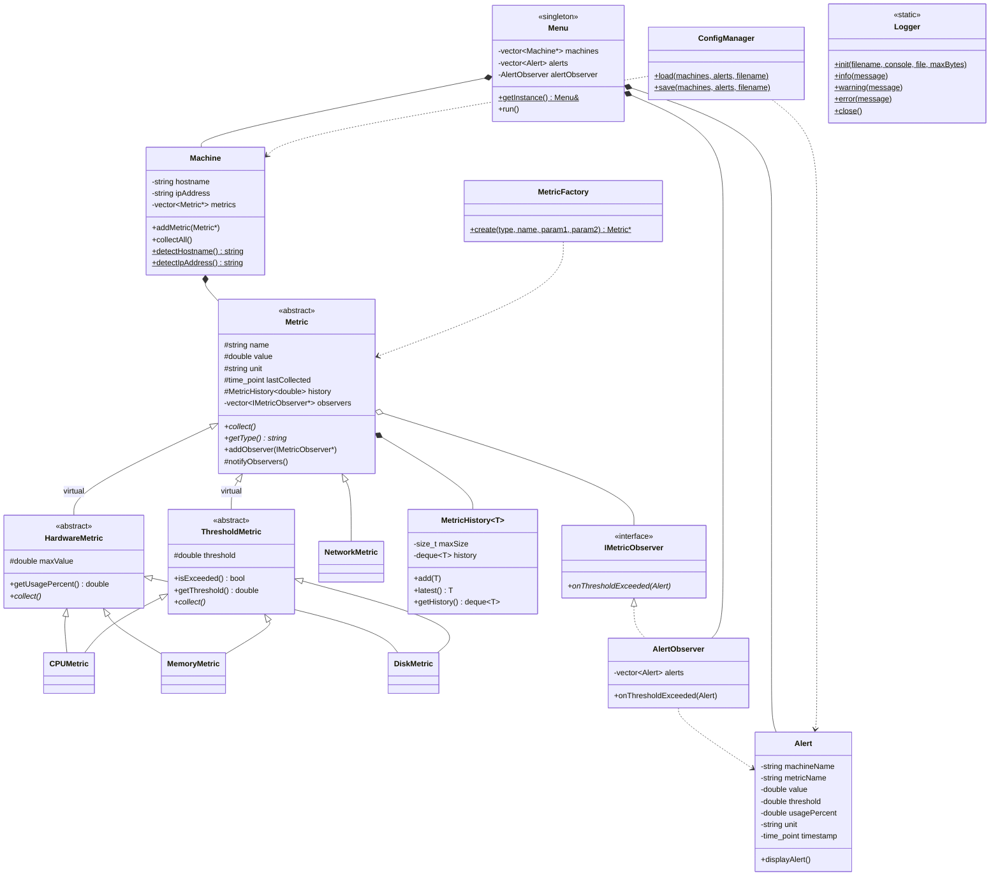
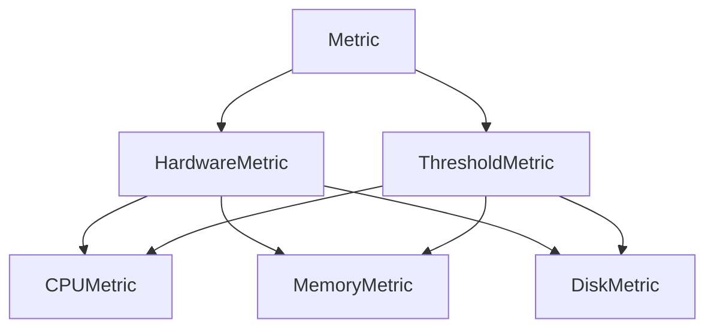

# Argus

Argus is an interactive terminal application for monitoring multiple machines and their hardware and network metrics. It is written in modern C++ and uses an object-oriented design to model machines, metrics, thresholds, alerts, history, persistence, and user interaction.

> This project was developed for the **Object-Oriented Programming** course at the Department of Mathematics and Computer Science, University of Bucharest, under the supervision of [Prof. PhD. Andrei Păun](https://scholar.google.com/citations?user=wWNnd94AAAAJ&hl=en).

## Current status

The following functionality is implemented:

- Full-screen terminal dashboard built with FTXUI
- Registration and removal of monitored machines
- Automatic detection of the local hostname and IPv4 address when adding a machine
- CPU, memory, disk, and network metrics
- Manual collection of all metrics for the selected machine
- Configurable thresholds for CPU, memory, and disk metrics
- Automatic alert generation through the Observer pattern
- A rolling history containing the latest 10 values for every metric
- JSON persistence for machines, metric definitions, and alerts
- Configuration loading at startup and saving on normal exit
- Factory-based metric construction
- Timestamped console and file logging with a configurable file-size limit
- Input validation and a custom exception hierarchy
- Debug sanitizer support through CMake on supported Clang and MSVC toolchains
- A GitHub Actions workflow for multi-compiler builds, memory checks, static analysis, installation, and build artifacts

Metric values are currently **simulated with random data**. Argus does not yet collect real operating-system statistics or communicate with remote machines.

## Interface and controls

The main screen displays registered machines on the left and the selected machine's metrics on the right.

| Key | Action |
|---|---|
| `Up` / `Down` | Select a machine or an item in a form |
| `C` | Collect metrics for the selected machine |
| `A` | Add a machine |
| `M` | Add a metric to the selected machine |
| `D` | Delete the selected machine |
| `Q` | Save the configuration and quit |
| `Enter` | Submit the current form |
| `Esc` | Cancel an add-machine or add-metric form |

When a machine is added, Argus pre-fills its hostname and IP address using the local system. Both values can be edited before submitting the form.

## Supported metrics

| Type | Unit | Range | Threshold behavior |
|---|---:|---:|---|
| CPU | `%` | `0-100` | Alert when the collected percentage exceeds the configured threshold |
| Memory | `MB` | `0-maxValue` | Alert when used capacity as a percentage of `maxValue` exceeds the threshold |
| Disk | `GB` | `0-maxValue` | Alert when used capacity as a percentage of `maxValue` exceeds the threshold |
| Network | `MB/s` | `0-1000` | No threshold |

Each call to `collect()` updates the metric's value and timestamp, stores the value in its rolling history, and notifies registered observers when applicable.

## Requirements

- A Linux environment for the current hostname and network-interface detection implementation
- A compiler with C++23 support
- CMake 3.15 or newer
- Git and an internet connection during the first configuration, because CMake downloads FTXUI with `FetchContent`
- A terminal compatible with FTXUI

The nlohmann JSON single-header library is already included in [`include/json.hpp`](include/json.hpp); no separate JSON package is required.

## Build and run

From the repository root:

```bash
cmake -S . -B build \
  -DCMAKE_BUILD_TYPE=Debug \
  -DCMAKE_EXPORT_COMPILE_COMMANDS=ON
cmake --build build --parallel
./build/oop
```

Warnings are treated as errors by default. They can be disabled for a local build if necessary:

```bash
cmake -S . -B build -DWARNINGS_AS_ERRORS=OFF
```

Run the executable from the repository root so that it reads and writes `config.json` and `argus.log` in the expected location.

## Persistence

`ConfigManager` uses nlohmann/json to load `config.json` when Argus starts. Pressing `Q` writes the current machines, metric definitions, and alerts back to the same file.

A configuration has the following general structure:

```json
{
  "machines": [
    {
      "hostname": "home-server",
      "ip": "192.168.1.10",
      "metrics": [
        {
          "type": "cpu",
          "name": "CPU Usage",
          "threshold": 85.0,
          "maxValue": 100.0
        },
        {
          "type": "disk",
          "name": "System Disk",
          "threshold": 90.0,
          "maxValue": 512.0
        }
      ]
    }
  ],
  "alerts": []
}
```

Metric values and their rolling histories are runtime data and are not currently persisted. Alert records are persisted without their original timestamps; loaded alerts receive the current time.

## Architecture

### Class hierarchy


```mermaid
classDiagram
    class Metric {
        <<abstract>>
        #string name
        #double value
        #string unit
        #time_point lastCollected
        #MetricHistory~double~ history
        -vector~IMetricObserver*~ observers
        +collect()*
        +getType()* string
        +addObserver(IMetricObserver*)
        #notifyObservers()
    }

    class HardwareMetric {
        <<abstract>>
        #double maxValue
        +getUsagePercent() double
        +collect()*
    }

    class ThresholdMetric {
        <<abstract>>
        #double threshold
        +isExceeded() bool
        +getThreshold() double
        +collect()*
    }

    class CPUMetric
    class MemoryMetric
    class DiskMetric
    class NetworkMetric

    class MetricHistory~T~ {
        -size_t maxSize
        -deque~T~ history
        +add(T)
        +latest() T
        +getHistory() deque~T~
    }

    class Machine {
        -string hostname
        -string ipAddress
        -vector~Metric*~ metrics
        +addMetric(Metric*)
        +collectAll()
        +detectHostname()$ string
        +detectIpAddress()$ string
    }

    class IMetricObserver {
        <<interface>>
        +onThresholdExceeded(Alert)*
    }

    class AlertObserver {
        -vector~Alert~ alerts
        +onThresholdExceeded(Alert)
    }

    class Alert {
        -string machineName
        -string metricName
        -double value
        -double threshold
        -double usagePercent
        -string unit
        -time_point timestamp
        +displayAlert()
    }

    class Menu {
        <<singleton>>
        -vector~Machine*~ machines
        -vector~Alert~ alerts
        -AlertObserver alertObserver
        +getInstance()$ Menu&
        +run()
    }

    class MetricFactory {
        +create(type, name, param1, param2)$ Metric*
    }

    class ConfigManager {
        +load(machines, alerts, filename)$
        +save(machines, alerts, filename)$
    }

    class Logger {
        <<static>>
        +init(filename, console, file, maxBytes)$
        +info(message)$
        +warning(message)$
        +error(message)$
        +close()$
    }

    Metric <|-- HardwareMetric : virtual
    Metric <|-- ThresholdMetric : virtual
    Metric <|-- NetworkMetric
    HardwareMetric <|-- CPUMetric
    HardwareMetric <|-- MemoryMetric
    HardwareMetric <|-- DiskMetric
    ThresholdMetric <|-- CPUMetric
    ThresholdMetric <|-- MemoryMetric
    ThresholdMetric <|-- DiskMetric
    Metric *-- MetricHistory
    Metric o-- IMetricObserver
    IMetricObserver <|.. AlertObserver
    AlertObserver ..> Alert
    Machine *-- Metric
    Menu *-- Machine
    Menu *-- AlertObserver
    Menu *-- Alert
    MetricFactory ..> Metric
    ConfigManager ..> Machine
    ConfigManager ..> Alert
```

### Diamond inheritance

`CPUMetric`, `MemoryMetric`, and `DiskMetric` inherit from both `HardwareMetric` and `ThresholdMetric`. Those two intermediate classes inherit virtually from `Metric`, ensuring that each concrete metric contains only one shared `Metric` base object.


```mermaid
flowchart TD
    Metric --> HardwareMetric
    Metric --> ThresholdMetric
    HardwareMetric --> CPUMetric
    HardwareMetric --> MemoryMetric
    HardwareMetric --> DiskMetric
    ThresholdMetric --> CPUMetric
    ThresholdMetric --> MemoryMetric
    ThresholdMetric --> DiskMetric
```

### Design patterns

#### Factory

`MetricFactory::create()` centralizes construction of CPU, memory, disk, and network metrics. The menu and configuration loader request a metric by type instead of duplicating construction logic.

#### Observer

Every `Metric` can register implementations of `IMetricObserver`. After collecting a value, threshold-aware metrics call `notifyObservers()`. `AlertObserver` responds by storing an `Alert` in the menu's alert collection and writing an informational log entry.

#### Singleton

`Menu::getInstance()` provides the single application menu and owns the active machines, alerts, and alert observer. Copy construction and copy assignment are disabled.

## Object-oriented programming concepts

| Concept or requirement | Implementation |
|---|---|
| Abstract classes and runtime polymorphism | `Metric`, `HardwareMetric`, and `ThresholdMetric`; virtual `collect()`, `getType()`, and `isExceeded()` behavior |
| Multi-level hierarchy | `Metric` to intermediate metric classes to concrete CPU, memory, and disk classes |
| Diamond inheritance | Virtual inheritance through `HardwareMetric` and `ThresholdMetric` |
| Encapsulation | Public interfaces with private or protected internal state |
| Template | `MetricHistory<T>` backed by `std::deque<T>` |
| STL containers | `std::vector` for machines, metrics, observers, and alerts; `std::deque` for metric history |
| Operator overloading | `operator<<` formats any `Metric` polymorphically |
| Static behavior | `Logger`, `MetricFactory`, `ConfigManager`, and machine detection helpers |
| Resource management | `Machine` deletes its owned metrics; `Menu` deletes its owned machines; copying is explicitly disabled |
| Custom exceptions | `ArgusException`, `InvalidMetricException`, `ThresholdExceededException`, `MachineNotFoundException`, and `InvalidInputException` |
| Design patterns | Factory, Observer, and Singleton |
| External libraries | FTXUI for the terminal UI and nlohmann/json for persistence |
| Separation of interface and implementation | Class declarations in `include/` and definitions in `src/` |

## Logging

`Logger` supports `INFO`, `WARNING`, and `ERROR` levels. The application initializes it with console and file output enabled, writes to `argus.log`, and truncates the log after it reaches the configured 1 MiB limit.

## Continuous integration

The GitHub Actions workflow is configured to build and install the application with the following environments:

- Ubuntu 24.04 with Clang 18
- Ubuntu 24.04 with GCC 13
- macOS 14 with Apple Clang
- Windows Server 2022 with MSVC
- Windows Server 2022 with MinGW and Ninja

Linux jobs also configure `compile_commands.json`, run Cppcheck, and perform memory checks with AddressSanitizer or Valgrind. Installed executables are uploaded as workflow artifacts with five-day retention. The current POSIX-specific machine detection code still requires portability work for native Windows builds.

## Project structure

```text
.
├── .github/workflows/      Multi-platform C++ CI configuration
├── CMakeLists.txt          Build configuration and dependencies
├── config.json            Persisted machines, metric definitions, and alerts
├── DEVLOG.md              Development notes for the second project stage
├── include/               Class declarations and bundled json.hpp
├── src/                   Class implementations and application entry point
├── proiect1.pdf           First-stage assignment specification
└── proiect2.pdf           Second-stage assignment specification
```

The generated executable is named `oop`, as defined by the CMake project name.

## Known limitations

- CPU, memory, disk, and network values are randomly generated rather than read from the operating system.
- Machines represent configured entries only; the application does not connect to remote hosts.
- Collection is manual and applies only to the currently selected machine in the FTXUI dashboard.
- Metric history is stored internally but is not yet visualized or persisted.
- Alerts are generated, logged, and persisted, but the current dashboard does not provide an alert-history screen.
- A CPU metric's custom threshold is not restored correctly from JSON after a restart; the current loader reconstructs it with the saved maximum value instead.
- Alert timestamps are not serialized.
- Automatic hostname and IP detection currently relies on Linux/POSIX APIs.
- FTXUI is fetched from its `main` branch, so dependency builds are not pinned to an immutable release.

## Possible next steps

- Replace simulated values with real platform-specific metric collectors
- Add remote-machine communication
- Display rolling history as terminal charts
- Add an alert-history panel to the dashboard
- Persist metric history and alert timestamps
- Correct CPU threshold restoration in `ConfigManager`
- Replace raw owning pointers with `std::unique_ptr`
- Pin FTXUI to a stable release or commit
- Add automated unit and integration tests
